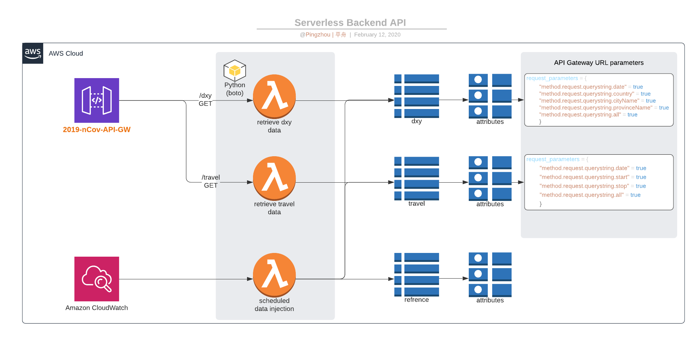

# 2019nCov-API [新冠疫情爬虫数据接口]
2019nCov-API 

# Data Sources [数据来源]
- real-time data: https://ncov.dxy.cn/ncovh5/view/pneumonia
- travel data: http://2019ncov.nosugartech.com
- baidu map api: http://api.map.baidu.com/
- google map api: https://developers.google.com/maps/documentation/directions/start

# AWS Setup 

DXY 网页爬虫数据和同城查询工具的数据每天3：30am 会录入AWS dynamodb tables.

#### The API Endpoint [爬虫数据接口]: `https://4mmhkv7z9e.execute-api.eu-west-1.amazonaws.com/v1/`

#### DXY 网页爬虫数据｜实时疫情数据
#### `path`: `/dxy` 

You can use this path to retrieve the stats of coronavirus including `id`, `date`, `country`, `provinceName`, `cityName`, `confirmedCount`, `suspectedCount`, `curedCount`, `deadCount`. Please be aware this ETL lambda function is scheduled from 2020-02-08. The latest data you can retrieve is from 2020-02-08. 

Required URL parameters are `date` OR `country` OR `provincName` OR `cityName` OR `all`. 

| path          | /dxy                                                                                                 |                                                                                                                                             |                                |
|---------------|------------------------------------------------------------------------------------------------------|---------------------------------------------------------------------------------------------------------------------------------------------|--------------------------------|
| url parameter | description                                                                                          | returned result                                                                                                                             | example                        |
| date          | Retrieve the coronavirus stats of a specific date. Accepted format is %Y-%m-%d (i.e. 2020-02-08).    | all fields from that date  | `/dxy?date=2020-02-08`           |
| country       | Retrieve the coronavirus stats of a specific country. Accepted format is urllib encoded strings.     | all fields from that country | `/dxy?country=''`         |
| provincName   | Retrieve the coronavirus stats of a specific provincName. Accepted format is urllib encoded strings. | all fields from that provincName | `/dxy?provincName=''` |
| cityName      | Retrieve the coronavirus stats of a specific country. Accepted format is urllib encoded strings.     | all fields from that cityName | `/dxy?cityName=''`       |
| all           | Set as 'yes' to retrieve all data                                                                    | all fields including id, date, country, provinceName, cityName, confirmedCount, suspectedCount, curedCount, deadCount                       | `/dxy?all='yes'`               |

#### examples
- search by the date:
```bash
$ curl -s https://4mmhkv7z9e.execute-api.eu-west-1.amazonaws.com/v1/dxy?date=2020-02-08 | jq .[0]
{
  "id": "228",
  "date": "2020-02-08",
  "country": "中国",
  "provinceName": "北京市",
  "cityName": "通州区",
  "confirmedCount": "15",
  "suspectedCount": "NULL",
  "curedCount": "NULL",
  "deadCount": "NULL",
  "msg": " No Man is an Island  🏝  没有人是一座孤岛 @pingzhou| 平舟 ⛵"
}
```
- search by cityName
```bash
# you will need to do url encode
# i.e. 武汉(wuhan) will be something like %E6%AD%A6%E6%B1%89 
$ curl -s https://4mmhkv7z9e.execute-api.eu-west-1.amazonaws.com/v1/dxy?cityName=%E6%AD%A6%E6%B1%89 | jq .
[
  {
    "id": "24",
    "date": "2020-02-08",
    "country": "中国",
    "provinceName": "湖北省",
    "cityName": "武汉",
    "confirmedCount": "13603",
    "suspectedCount": "NULL",
    "curedCount": "698",
    "deadCount": "545",
    "msg": " No Man is an Island  🏝  没有人是一座孤岛 @pingzhou| 平舟 ⛵"
  }
]
```
- to retrieve all data
```bash
$ curl -s https://4mmhkv7z9e.execute-api.eu-west-1.amazonaws.com/v1/dxy?all=yes | jq .[0]
{
  "id": "228",
  "date": "2020-02-08",
  "country": "中国",
  "provinceName": "北京市",
  "cityName": "通州区",
  "confirmedCount": "15",
  "suspectedCount": "NULL",
  "curedCount": "NULL",
  "deadCount": "NULL",
  "msg": " No Man is an Island  🏝  没有人是一座孤岛 @pingzhou| 平舟 ⛵"
}

```
#### 同城查询工具的数据
#### `path`: `/travel`

This path is to retrieve the confirmed cases' travel paths including `id`, `date`, `start`, `stop`, `t_type`, `t_no`, `t_no_sub`. 

Required URL parameters are `date` OR `start` OR `stop` OR `all`

| Path          | /travel                                                                                                               |                                     |                        |
|---------------|-----------------------------------------------------------------------------------------------------------------------|-------------------------------------|------------------------|
| url parameter | description                                                                                                           | returned result                     | example                |
| date          | Retrieve the coronavirus cases' travel paths of a specific date. Accepted format is %Y-%m-%d (i.e. 2020-02-08).       | all fields from that date           | `/travel?date=2020-02-08` |
| start         | Retrieve the coronavirus cases' travel paths of a specific starting point. Accepted format is urllib encoded strings. | all fields from that starting point | `/travel?start=''`        |
| end           | Retrieve the coronavirus cases' travel paths of a specific ending point. Accepted format is urllib encoded strings.   | all fields from that end point      | `/travel?end=''`          |
| all           | Set as 'yes' to retrieve all data                                                                                     | all fields                          | `/travel?all='yes'`       |

#### examples
- search by date
```bash
$ curl -s https://4mmhkv7z9e.execute-api.eu-west-1.amazonaws.com/v1/travel?date=2020-02-02 | jq .
[
  {
    "id": "1246",
    "date": "2020-02-02",
    "start": "南极国际小区",
    "stop": "哈尔滨传染病院",
    "type": "6",
    "t_no": "黑AE888Z",
    "t_no_sub": "网约车",
    "msg": " No Man is an Island  🏝  没有人是一座孤岛 @pingzhou| 平舟 ⛵"
  }
]
```
- search by start city
```bash
$ curl -s https://4mmhkv7z9e.execute-api.eu-west-1.amazonaws.com/v1/travel?start=%E6%AD%A6%E6%B1%89 | jq .[0]
{
  "id": "475",
  "date": "2020-01-19",
  "start": "武汉",
  "stop": "成都东",
  "type": "2",
  "t_no": "D366",
  "t_no_sub": "03号车厢",
  "msg": " No Man is an Island  🏝  没有人是一座孤岛 @pingzhou| 平舟 ⛵"
}
```
- to retrieve all data
```bash
$ curl -s https://4mmhkv7z9e.execute-api.eu-west-1.amazonaws.com/v1/travel?all=yes | jq .[0]
{
  "id": "228",
  "date": "2020-01-17",
  "start": "海口东",
  "stop": "棋子湾",
  "type": "2",
  "t_no": "C7402",
  "t_no_sub": "NULL",
  "msg": " No Man is an Island  🏝  没有人是一座孤岛 @pingzhou| 平舟 ⛵"
}
```
